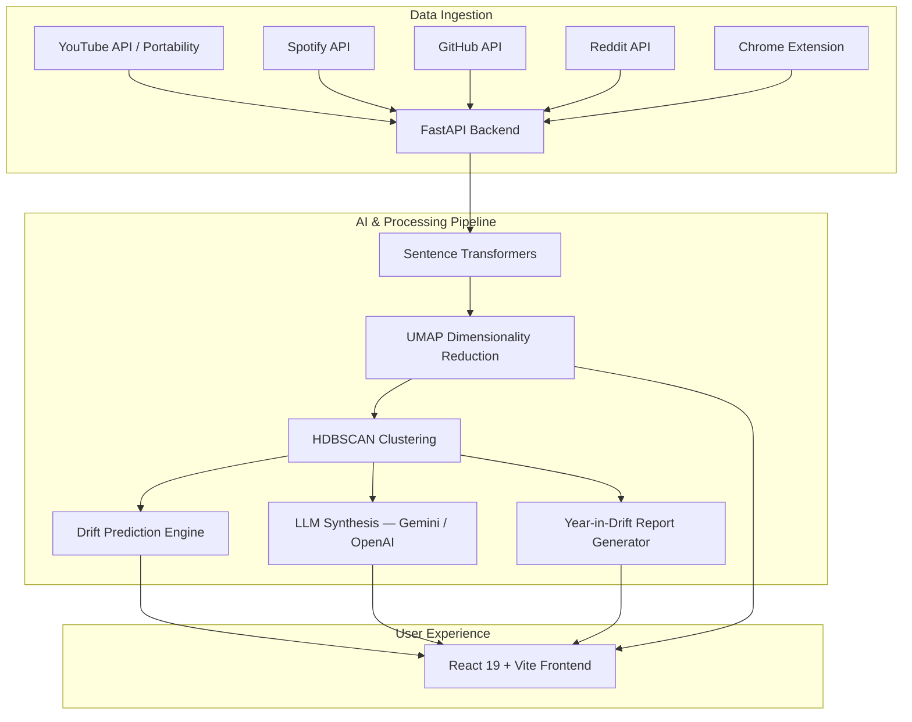

# 🌀 Drifter — Year in Drift

> **AI-powered personal interest evolution, timeline tracking, and curiosity discovery platform.**

Drifter analyses your digital footprint across **YouTube**, **Spotify**, **GitHub**, **Reddit**, and **general web browsing** to visualise, cluster, and predict how your interests drift over time — then wraps it all in a *Spotify Wrapped*-style narrative you can actually explore.

---

## ✨ Features

### 🌐 Multi-Platform Data Ingestion

| Source | Method |
|---|---|
| **YouTube / Google** | OAuth 2.0 + Google Data Portability API (`dataportability.myactivity.youtube`) |
| **Spotify** | OAuth — top artists, listening trends, audio features |
| **GitHub** | OAuth — starred repos, commit activity, programming topic evolution |
| **Reddit** | OAuth — subreddits, saved posts, upvoted content, comment threads |
| **Chrome Extension** | Real-time active dwell-time & watch-event capture across YouTube, Spotify Web, Netflix, Steam, Twitter/X, GitHub, and general browsing — zero manual exports |

### 🤖 AI & ML Intelligence Engine

- **Semantic Embeddings** — `sentence-transformers` builds dense vector representations of your consumption history.
- **Unsupervised Clustering** — `HDBSCAN` + `UMAP` auto-detect emerging topics, interest clusters, and paradigm shifts.
- **Drift Velocity & Prediction** — Calculates interest decay rates and forecasts next-quarter curiosity topics.
- **LLM Synthesis** — Gemini and OpenAI integrations generate personalized narrative reports and power **Drifter Chat**.

### 🎨 Modern Visual Dashboard

- **Interactive 2D/3D Interest Maps** — Three.js, React Three Fiber, Recharts.
- **8 Workspace Views** — Overview, Interest Map, Evolution, Behavior, History, Prediction, Correlation, Interest DNA.
- **Year-in-Drift Report** — A 5-chapter *Spotify Wrapped*-style story: Scale → Gravity Well → The Pivot → The Deep Dive → Your Archetype.
- **Data Import & Extension Sync Modal** — Frictionless OAuth management, 1-click extension token pairing, Google Takeout archive import.

### ⚡ Real-time & Operations

- **WebSocket** endpoint for live analysis progress streaming.
- **In-memory cache** with `DELETE /api/cache/clear` for instant invalidation.
- **Health check** (`/health`) reporting DB, LLM key, and OAuth provider status.
- **Docker Compose** for one-command local environment.

---

## 🏗 System Architecture



---

## 🛠 Tech Stack

### Backend

| Layer | Technology |
|---|---|
| Framework | [FastAPI](https://fastapi.tiangolo.com/) (Python 3.10+) |
| Database | [SQLAlchemy](https://www.sqlalchemy.org/) ORM — SQLite (default) or PostgreSQL |
| Migrations | Alembic |
| ML / Data Science | `sentence-transformers`, `scikit-learn`, `hdbscan`, `umap-learn`, `numpy`, `scipy` |
| Auth | OAuth 2.0 — Google, Spotify, GitHub, Reddit + `SessionMiddleware` |
| Real-time | WebSocket via FastAPI |

### Frontend

| Layer | Technology |
|---|---|
| Framework | [React 19](https://react.dev/) + [Vite](https://vitejs.dev/) + [TypeScript](https://www.typescriptlang.org/) |
| Styling | [Tailwind CSS v4](https://tailwindcss.com/), Framer Motion, Lucide Icons, Hugeicons |
| 3D & Viz | Three.js, `@react-three/fiber`, `@react-three/drei`, Recharts, `@tsparticles/react` |
| UI Primitives | shadcn/ui (`components.json`) |

### Browser Extension

- Chrome Manifest V3 — real-time dwell-time & watch-event streaming via `content.js` + `background.js`

### Infrastructure

- `docker-compose.yml` for containerised local development
- Nginx config included for frontend production serving
- Dockerfiles for both backend and frontend

---

## 📁 Repository Structure

```text
drifter/
├── backend/
│   ├── app/
│   │   ├── ai/               # LLM integration & prompt builders
│   │   ├── analytics/        # Time-series analytics & metrics
│   │   ├── api/              # Route handlers — Auth, Spotify, YouTube,
│   │   │                     #   GitHub, Reddit, History, Analytics,
│   │   │                     #   Extension API, WebSocket
│   │   ├── behavior/         # User behaviour modelling (rabbit holes, streaks)
│   │   ├── clustering/       # UMAP + HDBSCAN clustering modules
│   │   ├── database/         # SQLAlchemy models & engine
│   │   ├── drift/            # Velocity & interest trajectory math
│   │   ├── embeddings/       # Transformer embedding generation
│   │   ├── ingestion/        # Multi-platform data parsers
│   │   ├── prediction/       # ML prediction models
│   │   ├── reports/          # Year-in-Drift report generator
│   │   ├── services/         # Shared services (cache, etc.)
│   │   ├── config.py         # Settings & environment
│   │   └── main.py           # FastAPI entrypoint & DB init
│   ├── migrations/           # Alembic migrations
│   ├── requirements.txt
│   ├── Dockerfile
│   └── year_in_drift.db      # SQLite database (gitignored in prod)
├── frontend/
│   ├── src/
│   │   ├── components/
│   │   │   ├── analytics/    # InterestMomentum, Evolution, Distribution,
│   │   │   │                 #   Correlation, PlatformIntelligenceHub
│   │   │   ├── auth/         # Auth views
│   │   │   ├── chat/         # Drifter Chat UI
│   │   │   ├── dashboard/    # WorkspaceViews (main dashboard)
│   │   │   ├── onboarding/   # First-run onboarding flow
│   │   │   ├── prediction/   # PredictionView
│   │   │   ├── reports/      # InterestDnaCard, Year-in-Drift slides
│   │   │   ├── ui/           # Shared UI primitives (NumberTicker, etc.)
│   │   │   ├── ExtensionSyncModal.tsx
│   │   │   ├── ImportHistoryModal.tsx
│   │   │   └── InterestMap.tsx
│   │   ├── hooks/
│   │   ├── lib/
│   │   ├── services/         # API clients (analytics, history, etc.)
│   │   ├── types/
│   │   ├── App.tsx           # Root application & routing
│   │   └── index.css         # Tailwind v4 config & global styles
│   ├── components.json       # shadcn/ui config
│   ├── nginx.conf
│   ├── Dockerfile
│   └── package.json
├── extension/
│   ├── manifest.json         # Chrome MV3 manifest
│   ├── background.js         # Event processing & API bridge
│   ├── content.js            # Page activity tracker
│   ├── popup.js              # Extension popup logic
│   └── popup.html            # Extension popup UI
├── docker-compose.yml
├── .env.example
└── README.md
```

---

## 🚀 Getting Started

### Prerequisites

- **Python** 3.10+
- **Node.js** v18+ (npm)
- **Git**
- **Google Chrome** (for the extension)

---

### 1. Clone & Configure Environment

```bash
git clone https://github.com/your-username/drifter.git
cd drifter
cp .env.example .env
```

Edit `.env` with your credentials:

```env
# Core
FRONTEND_URL=http://localhost:5173
BACKEND_URL=http://127.0.0.1:8000
SESSION_SECRET=change-me-to-a-random-string
DATABASE_URL=sqlite:///./year_in_drift.db

# Google OAuth (YouTube + Google Portability)
GOOGLE_CLIENT_ID=your_google_client_id.apps.googleusercontent.com
GOOGLE_CLIENT_SECRET=your_google_client_secret

# Spotify
SPOTIFY_CLIENT_ID=your_spotify_client_id
SPOTIFY_CLIENT_SECRET=your_spotify_client_secret
SPOTIFY_REDIRECT_URI=http://127.0.0.1:8000/api/auth/spotify/callback

# GitHub
GITHUB_CLIENT_ID=your_github_client_id
GITHUB_CLIENT_SECRET=your_github_client_secret
GITHUB_REDIRECT_URI=http://127.0.0.1:8000/api/github/callback

# Reddit
REDDIT_CLIENT_ID=your_reddit_client_id
REDDIT_CLIENT_SECRET=your_reddit_client_secret
REDDIT_REDIRECT_URI=http://127.0.0.1:8000/api/reddit/callback

# AI / LLM (optional — enables Drifter Chat & narrative reports)
GEMINI_API_KEY=your_gemini_api_key
OPENAI_API_KEY=your_openai_api_key

# Frontend
VITE_API_URL=http://localhost:8000
VITE_BACKEND_URL=http://localhost:8000
```

---

### 2. Backend Setup

```bash
cd backend

# Create & activate virtual environment
python -m venv venv
# Windows:
.\venv\Scripts\activate
# Linux / macOS:
source venv/bin/activate

# Install dependencies
pip install -r requirements.txt

# Start the dev server
uvicorn app.main:app --reload --port 8000
```

- API: `http://127.0.0.1:8000`
- Interactive docs: `http://127.0.0.1:8000/docs`
- Health check: `http://127.0.0.1:8000/health`

---

### 3. Frontend Setup

```bash
# In a new terminal, from the repo root:
cd frontend
npm install
npm run dev
```

Frontend runs at `http://localhost:5173`.

---

### 4. Chrome Extension Setup

1. Open Chrome → `chrome://extensions/`
2. Enable **Developer mode** (top-right toggle).
3. Click **Load unpacked** → select the `extension/` folder.
4. In the Drifter dashboard, open the **Extension Sync Modal** to copy your personal Sync Token.
5. Open the Drifter extension popup, paste your Sync Token and set the backend URL to `http://127.0.0.1:8000`.

---

### 5. Docker (Optional)

```bash
docker compose up --build
```

This starts the backend and frontend in containers. Configure credentials via your `.env` file.

---

## 🧠 Workspace Views

| View | Description |
|---|---|
| **Overview** | High-level stats, source breakdown, top topics |
| **Interest Map** | Interactive 2D/3D cluster visualisation (Three.js) |
| **Evolution** | Monthly drift velocity & emerging / fading topic arcs |
| **Behavior** | Rabbit-hole sessions, streaks, nocturnal patterns |
| **History** | Searchable & filterable raw event log with delete support |
| **Prediction** | ML-forecasted next-quarter interest targets |
| **Correlation** | Cross-platform topic correlation matrix |
| **Interest DNA** | Personality-style interest archetype card |

---

## 📖 Year-in-Drift Report

A **5-chapter interactive story** generated from your data:

| Chapter | Focus |
|---|---|
| **01 — Scale** | Total traces, active days, interest clusters, longest streak |
| **02 — Gravity Well** | Dominant topic & attention share breakdown |
| **03 — The Pivot** | Peak drift month & velocity metric |
| **04 — The Deep Dive** | Deepest rabbit-hole session + nocturnal ratio |
| **05 — Your Archetype** | *Midnight Synthesizer*, *Polymorphic Explorer*, *Deep-Sea Specialist*, or *Kinetic Nomad* |

---

## 🔒 Google Data Portability API

Drifter optionally requests extended YouTube watch history via the **Google Data Portability API**.

- **Scope**: `dataportability.myactivity.youtube`
- Google creates the export archive asynchronously (minutes to days depending on data size).
- Drifter tracks export job status and auto-imports the completed archive into the embedding, clustering, and topic pipeline.
- Production use requires Google app verification unless operating under a development/testing exception.
- See [Google Data Portability API docs](https://developers.google.com/data-portability/user-guide/introduction) for requirements.

---

## 🔌 API Overview

| Method | Endpoint | Description |
|---|---|---|
| `GET` | `/` | Service info |
| `GET` | `/health` | DB, LLM, provider status |
| `DELETE` | `/api/cache/clear` | Flush analysis cache |
| `GET` | `/api/analytics/...` | Dashboard analytics |
| `GET/DELETE` | `/api/history/...` | History event CRUD |
| `GET/POST` | `/api/spotify/...` | Spotify OAuth & sync |
| `GET/POST` | `/api/youtube/...` | YouTube OAuth & sync |
| `GET/POST` | `/api/github/...` | GitHub OAuth & sync |
| `GET/POST` | `/api/reddit/...` | Reddit OAuth & sync |
| `POST` | `/api/extension/...` | Chrome extension event ingest |
| `WS` | `/ws/...` | Real-time analysis streaming |

Full interactive documentation at `http://127.0.0.1:8000/docs`.

---

## 📜 License

This project is licensed under the **MIT License**. See [LICENSE](LICENSE) for details.
