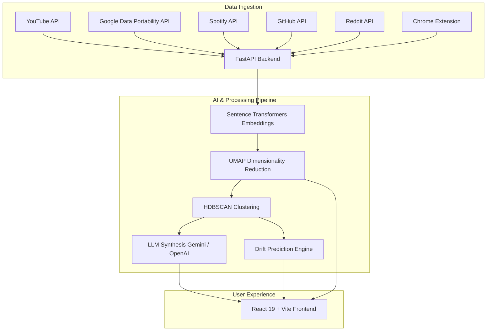

# 🌀 Drifter (Year in Drift)

> **AI-powered personal interest evolution, timeline tracking, and curiosity discovery platform.**

Drifter analyzes your digital footprint across **YouTube**, **Spotify**, **GitHub**, **Reddit**, and **web browsing activity** to visualize, cluster, and predict how your interests, hobbies, and learning patterns drift over time.

---

## ✨ Features

- **🌐 Multi-Platform Activity Ingestion**
  - **YouTube & Google History**: Native OAuth integration + Google Data Portability API (`dataportability.myactivity.youtube`) for full watch history export.
  - **Spotify**: Tracks music listening trends, artist shifts, and acoustic parameters over time.
  - **GitHub**: Integrates starred repos, user activity, and programming language topic evolution.
  - **Reddit**: Ingests subreddits, saved posts, and community engagement to map topic curiosity.
  - **Chrome Extension**: Captures real-time browsing events securely and streams them to your personal analytics pipeline.

- **🤖 AI & ML Intelligence Engine**
  - **Semantic Embeddings**: Leverages `sentence-transformers` to construct dense vector spaces of your digital consumption.
  - **Unsupervised Clustering**: Uses `HDBSCAN` and `UMAP` to automatically detect emerging topics, clusters, and paradigm shifts.
  - **Interest Trajectory & Prediction**: Calculates drift velocity, decay rates, and forecasts next-quarter curiosity topics.
  - **LLM Synthesis & Drifter Chat**: Integrated with Gemini and OpenAI APIs to generate personalized narrative reports and contextual AI chat.

- **🎨 Modern Visual Dashboard**
  - **Interactive 2D/3D Interest Maps**: Powered by **Three.js**, **React Three Fiber**, and **Recharts**.
  - **Data Import & Extension Sync Modal**: Frictionless OAuth management and Takeout archive importing.
  - **Personalized Year-in-Drift Reports**: Synthesized visual insights into your intellectual journey.

---

## 🏗 System Architecture



---

## 🛠 Tech Stack

### **Backend**
- **Framework**: [FastAPI](https://fastapi.tiangolo.com/) (Python 3.10+)
- **Database**: [SQLAlchemy](https://www.sqlalchemy.org/) ORM with SQLite
- **ML & Data Science**: `sentence-transformers`, `scikit-learn`, `hdbscan`, `umap-learn`, `numpy`, `scipy`
- **Authentication**: OAuth 2.0 (Google, Spotify, GitHub, Reddit), Session Middleware

### **Frontend**
- **Framework**: [React 19](https://react.dev/), [Vite](https://vitejs.dev/), [TypeScript](https://www.typescriptlang.org/)
- **Styling**: [Tailwind CSS v4](https://tailwindcss.com/), Framer Motion (`motion`), Lucide Icons, Hugeicons
- **3D & Visualizations**: Three.js, `@react-three/fiber`, `@react-three/drei`, Recharts, `@tsparticles/react`

### **Browser Extension**
- **Platform**: Chrome Manifest V3 Extension for background web history streaming

---

## 📁 Repository Structure

```text
drifter/
├── backend/                  # FastAPI Application & ML Pipelines
│   ├── app/
│   │   ├── ai/               # LLM integration & prompt builders
│   │   ├── analytics/        # Time-series analytics & metrics
│   │   ├── api/              # API route handlers (Auth, Services, History)
│   │   ├── behavior/         # User behavior modeling
│   │   ├── clustering/       # UMAP & HDBSCAN clustering modules
│   │   ├── database/         # Database models & connections
│   │   ├── drift/            # Velocity & interest trajectory math
│   │   ├── embeddings/       # Transformer embedding generation
│   │   ├── ingestion/        # Multi-platform data parsers
│   │   ├── prediction/       # ML prediction models
│   │   ├── reports/          # Report generation pipeline
│   │   └── main.py           # FastAPI entrypoint
│   ├── requirements.txt      # Python dependencies
│   └── year_in_drift.db      # SQLite database storage
├── frontend/                 # React 19 + TypeScript Single Page App
│   ├── src/
│   │   ├── components/       # Analytics, 3D Canvas, Maps, Modals
│   │   ├── services/         # API clients (Axios)
│   │   ├── App.tsx           # Main Application Dashboard
│   │   └── index.css         # Tailwind v4 configuration
│   └── package.json          # Node dependencies & build scripts
├── extension/                # Chrome Manifest V3 Extension
│   ├── manifest.json         # Extension Manifest
│   ├── background.js         # Event processing & API bridge
│   ├── content.js            # Page activity tracker
│   └── popup.html            # Extension Popup UI
├── notebooks/                # Jupyter Notebooks for ML experiments
├── docker-compose.yml        # Docker orchestration file
├── .env.example              # Environment variables template
└── README.md                 # Project documentation
```

---

## 🚀 Getting Started

### **Prerequisites**
- **Python**: 3.10 or higher
- **Node.js**: v18 or higher (npm / pnpm / yarn)
- **Git**

---

### **1. Clone & Environment Configuration**

```bash
git clone https://github.com/your-username/drifter.git
cd drifter
cp .env.example .env
```

Edit `.env` to supply your client keys for OAuth providers (Google, Spotify, GitHub, Reddit) and AI keys (Gemini or OpenAI).

---

### **2. Backend Setup**

```bash
cd backend

# Create virtual environment
python -m venv venv

# Activate virtual environment
# Windows:
.\venv\Scripts\activate
# Linux/macOS:
source venv/bin/activate

# Install dependencies
pip install -r requirements.txt

# Run FastAPI dev server
uvicorn app.main:app --reload --port 8000
```

The backend server will run at `http://localhost:8000`. You can view the interactive API documentation at `http://localhost:8000/docs`.

---

### **3. Frontend Setup**

In a new terminal window:

```bash
cd frontend

# Install Node dependencies
npm install

# Start Vite dev server
npm run dev
```

The frontend application will open at `http://localhost:5173`.

---

### **4. Chrome Extension Setup**

1. Open Chrome and navigate to `chrome://extensions/`.
2. Enable **Developer mode** in the top right corner.
3. Click **Load unpacked**.
4. Select the `drifter/extension` directory from this repository.
5. Click on the extension popup icon to connect it to your local backend (`http://localhost:8000`).

---

## 🔒 Google Data Portability API Notice

Drifter supports requesting extended YouTube watch history through the **Google Data Portability API**.

- Scope used: `dataportability.myactivity.youtube`
- Google creates the export archive asynchronously. This process may take minutes, hours, or days depending on data size.
- Drifter automatically tracks the export job status and imports the completed archive into your embeddings, clustering, and topic analysis pipeline once available.
- Production usage requires Google app verification and security compliance unless operating under a development/testing exception.
- Refer to the [Google Data Portability API Documentation](https://developers.google.com/data-portability/user-guide/introduction) for requirements.

---

## 📜 License

This project is licensed under the MIT License. See [LICENSE](LICENSE) for details.
